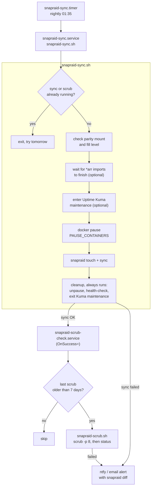
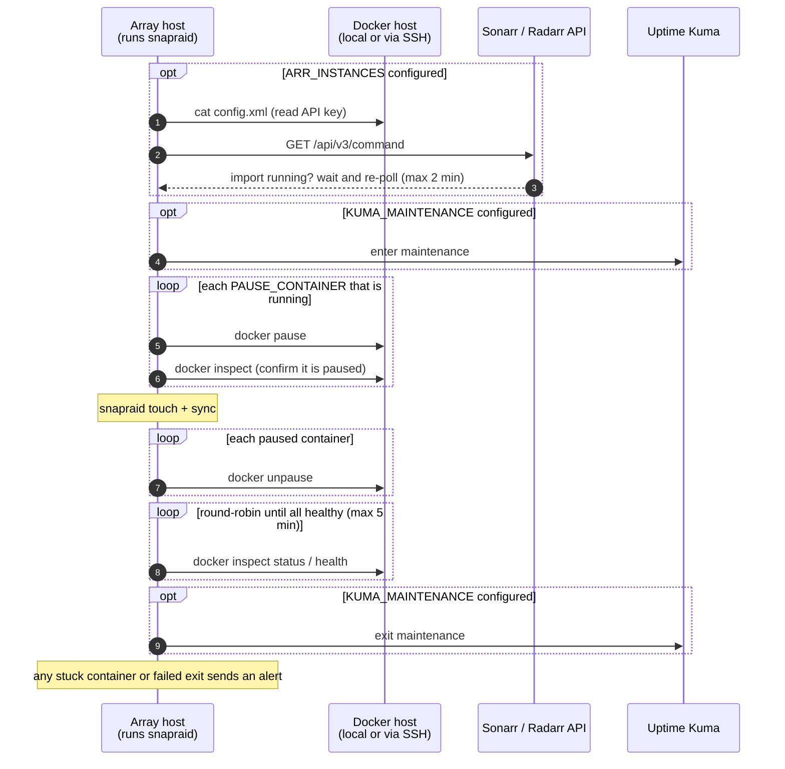
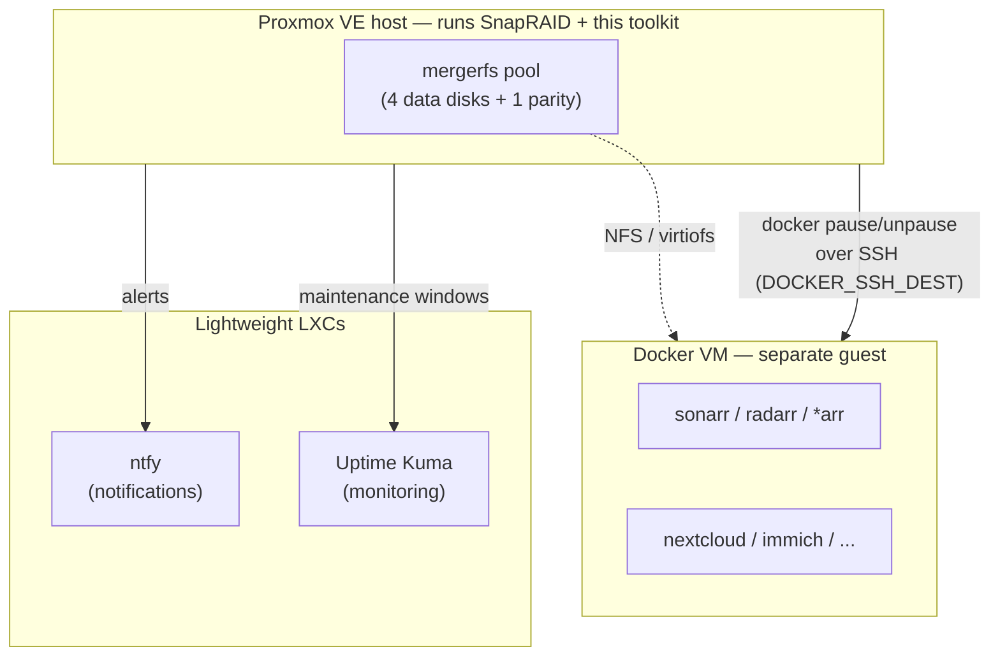

# snapraid-mergerfs-toolkit

Bash scripts and systemd units for running a [SnapRAID](https://www.snapraid.it/) + [mergerfs](https://github.com/trapexit/mergerfs) array unattended on a home server — including one where Docker containers (the *arr stack, Nextcloud, Immich, …) write to the array, possibly from a separate VM.

Every script here exists because something simpler failed in practice. The design notes in each script's header explain the specific failure it guards against.

## What's included

| Script | What it does |
|---|---|
| `bin/snapraid-sync.sh` | Nightly `touch` + `sync`. Before syncing it waits for in-flight Sonarr/Radarr/Lidarr imports to finish, optionally puts Uptime Kuma into maintenance, and `docker pause`s the containers that write to the array (locally or over SSH). Afterwards it **always** unpauses them, verifies they return healthy, and exits maintenance, even if the sync fails. Checks parity disk fill level. Logs data volume and throughput per run. |
| `bin/snapraid-scrub-trigger.sh` | Day-gate that runs after every *successful* sync (systemd `OnSuccess=`) and hands off to the scrub once N days have passed. There's no fixed-time scrub timer that could race a long sync. |
| `bin/snapraid-scrub.sh` | `snapraid scrub -p N`, then appends `snapraid status` to the log. |
| `bin/snapraid-check.sh` | Manual full `snapraid check` with live output, a log, and a summary notification. |
| `bin/migration-watch.sh` | Progress notifier for long manual jobs (rsync onto a new disk, `snapraid sync/scrub`, `mergerfs.balance`, or anything that writes a done marker). Sends a notification at each 10% with an ETA, and another on completion or failure. |
| `bin/sync-guard.sh` | Crash and stall detector for a long command running in the foreground of an interactive tmux pane. Pairs with `migration-watch.sh`. |
| `bin/balance-monitor.sh` | Live terminal dashboard for `mergerfs.balance`: per-branch usage, free-space spread, progress, and ETA, with periodic ntfy pushes. |
| `bin/kuma-maintenance.py` | Optional. Toggles an Uptime Kuma *Manual* maintenance window from scripts. |

Notifications go to [ntfy](https://ntfy.sh) and/or email via `msmtp`. Either can be disabled.

## Requirements

- `snapraid`, `bash` ≥ 4.4, `curl`, `python3` (used to parse *arr API JSON)
- systemd ≥ 249 (for `OnSuccess=`, which chains the scrub to the sync)
- Optional: `msmtp` (email), `docker` locally or reachable over key-based SSH, `tmux` (sync-guard), `bc` + `mergerfs-tools` (balance tools), `uptime-kuma-api` Python package (Kuma helper)

## How it works

Every night a systemd timer starts the sync. Only a **successful** sync triggers the scrub check, so a scrub can never overlap a sync, however long it runs.



The container pause is what makes an unattended sync reliable. SnapRAID fails a sync if a file changes while it's being read, so anything that writes to the array is frozen (`docker pause`, not stopped, so they resume in seconds) for the duration of the sync:



Unpause and exiting maintenance run from an `EXIT` trap, so they happen even if the sync fails or the script is killed.

## Reference environment

This toolkit was built for, and is tested against, a setup like this — it's the reason several of the config options exist:



- **SnapRAID and this toolkit run on the hypervisor** (a Proxmox VE host, though nothing here is Proxmox-specific), directly against a mergerfs pool of data disks + a parity disk. Running at this layer, rather than inside a VM, means array maintenance never depends on any guest being up.
- **Docker runs in a separate VM**, not on the host. The array is exposed to it over NFS or virtiofs, not a raw disk passthrough. This is why `snapraid-sync.sh` pauses containers over SSH (`DOCKER_SSH_DEST`) instead of calling `docker` directly, and why every remote `docker inspect` call uses one plain template field — see the design notes at the top of that script for the exact failure that came from combining fields in one call.
- **Small services get their own lightweight LXC** rather than sharing the Docker VM's blast radius: a notification relay (ntfy) and a monitoring/maintenance-window tool (Uptime Kuma) are the two this toolkit talks to. Host-originated alerts (a failed sync) reaching ntfy this way don't depend on the Docker VM or anything in it being up.
- **None of this is required.** Everything above is configurable or optional: run Docker on the same host and leave `DOCKER_SSH_DEST` empty, skip `PAUSE_CONTAINERS` entirely if nothing writes to the array, or drop `ARR_INSTANCES`/`KUMA_MAINTENANCE` if you don't run those. The scripts were written generic; this section just explains where the specific features came from.

## Quick start

This gets a nightly, container-aware sync running with ntfy alerts. It assumes SnapRAID is already set up: `/etc/snapraid.conf` exists and `sudo snapraid status` works. If not, start from [`config/snapraid.conf.example`](config/snapraid.conf.example).

**1. Install the scripts and units**

```bash
git clone https://github.com/pinoybear/snapraid-mergerfs-toolkit.git
cd snapraid-mergerfs-toolkit
sudo install -m 755 bin/* /usr/local/bin/
sudo install -m 644 systemd/*.service systemd/*.timer /etc/systemd/system/
sudo install -m 600 config/snapraid-toolkit.conf.example /etc/snapraid-toolkit.conf
```

**2. Set the minimum config** in `/etc/snapraid-toolkit.conf`:

```bash
NTFY_URL="https://ntfy.sh/your-private-topic"   # and/or EMAIL_TO="you@example.com"
PARITY_MOUNT="/mnt/parity1"                     # your parity disk's mount point
PAUSE_CONTAINERS=(sonarr radarr nextcloud-app)  # containers that write to the array
```

Leave `PAUSE_CONTAINERS=()` empty if nothing writes to the array during the sync window. Everything else is optional; see [Configuration](#configuration).

**3. Check that notifications arrive**

```bash
curl -d "snapraid-toolkit test" "https://ntfy.sh/your-private-topic"
```

**4. Run one sync by hand and watch it**

```bash
sudo systemctl daemon-reload
sudo systemctl start --no-block snapraid-sync.service   # returns immediately; the sync runs in the background
sudo tail -f /var/log/snapraid.log
```

A healthy run logs roughly:

```
[SYNC] Starting SnapRAID Sync on myserver...
[SYNC] Pausing active write containers to prevent file churn...
[SYNC] Paused container: sonarr
[SYNC] Running snapraid touch...
[SYNC] Running snapraid sync...
[SYNC] Sync data volume: ~2048 MB moved in 95s (~21 MB/s wall-clock avg).
[SYNC] Sync Complete Successfully.
[SYNC] Unpausing and verifying containers...
[SYNC] Container sonarr is now: running (Health: healthy)
[SCRUB-TRIGGER] Scrub is due -- handing off to /usr/local/bin/snapraid-scrub.sh
```

On the first run there's no previous scrub on record, so a scrub (8% of the array) starts right after the sync. That's expected, and it can take a while. After that, scrubs run at most once every 7 days.

**5. Turn on the nightly timer**

```bash
sudo systemctl enable --now snapraid-sync.timer
systemctl list-timers 'snapraid*'
```

That's it. Next steps, all optional: wait for Sonarr/Radarr imports (`ARR_INSTANCES`), run Docker on another machine (`DOCKER_SSH_DEST`), or silence Uptime Kuma during the pause (`KUMA_MAINTENANCE`).

## Configuration

All site-specific settings live in `/etc/snapraid-toolkit.conf`, which is sourced as bash. See [`config/snapraid-toolkit.conf.example`](config/snapraid-toolkit.conf.example) for every option. The important ones:

- `PAUSE_CONTAINERS=(...)`: containers that write to the array. SnapRAID fails a sync when a file changes while it's being read, so pause anything that writes there.
- `DOCKER_SSH_DEST="user@host"`: set this when Docker runs on a different machine (e.g. a VM that mounts the array over NFS). Leave it empty for local Docker.
- `ARR_INSTANCES=("sonarr|http://host:8989|/path/to/sonarr/config.xml")`: optional import quiesce. Each API key is read from the app's own `config.xml`, so no second copy is stored.
- `KUMA_MAINTENANCE=("http://kuma:3001|<maintenance id>")`: optional. Put `KUMA_USER=` / `KUMA_PASSWORD=` in `KUMA_CREDENTIALS_FILE` (mode 600).

Point any script at a different config with `SNAPRAID_TOOLKIT_CONF=/path/to/file`.

### Notes

- If `DOCKER_SSH_DEST` is set, the SSH user needs access to `docker` (e.g. membership in the `docker` group) and read access to the *arr `config.xml` files.
- Scripts only send plain arguments over SSH (no pipes or regexes), so they work even when the remote login shell is fish or another non-POSIX shell.
- `snapraid-scrub.service` is for manual runs. The normal path is `snapraid-sync.service` → `OnSuccess=` → `snapraid-scrub-check.service` → scrub, when due.

## Watching a long manual job

```bash
# pane 1: the job itself, with a done marker appended
tmux new -s balance "mergerfs.balance -p 2 /mnt/storage 2>&1 | tee /var/log/balance.log"
# pane 2: live dashboard
balance-monitor.sh --pool /mnt/storage
# pane 3: 10% progress + completion notifications
migration-watch.sh --mode balance --label "Rebalance after adding disk" \
    --log /var/log/balance.log --balance-mounts /mnt/data1,/mnt/data2,/mnt/data3,/mnt/data4
```

See `systemd/examples/` for running `sync-guard.sh` and `migration-watch.sh` as services.

## License

MIT
